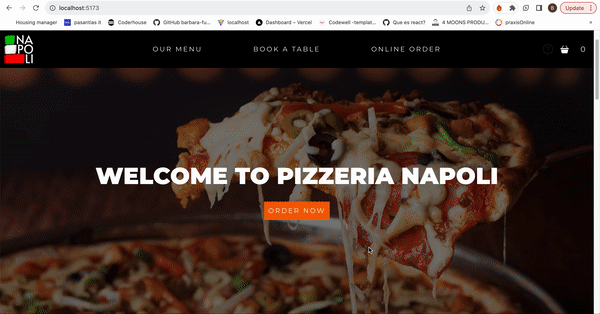
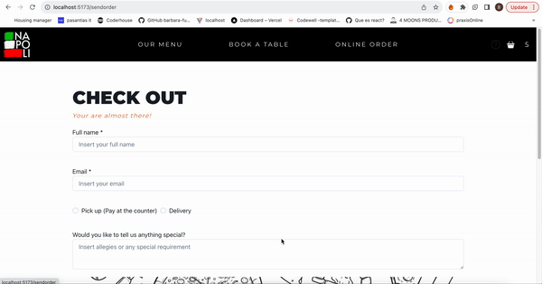
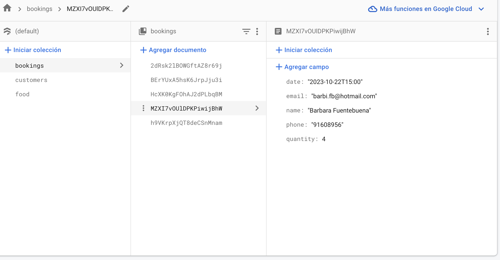
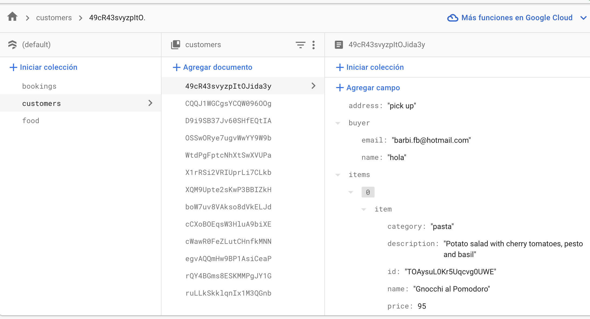

# React + Vite

# *Welcome to Pizzeria Napoli!*

This project was created as part of a React.js course at Coderhouse. It focuses on developing a website for a pizzeria that offers online purchases. Users can view the restaurant's menu, make a reservation, and purchase products online, choosing between in-store pickup or delivery.

## _Features_

- View the restaurant's menu.
- Make a reservation for a table.
- Purchase products online with the option for in-store pickup or delivery.

## _Functionality_

- A GIF showcasing the application's functionality is available below:

## _Database_

The project utilizes Firebase as a backend, storing product information, bookings, and orders received through the forms:

